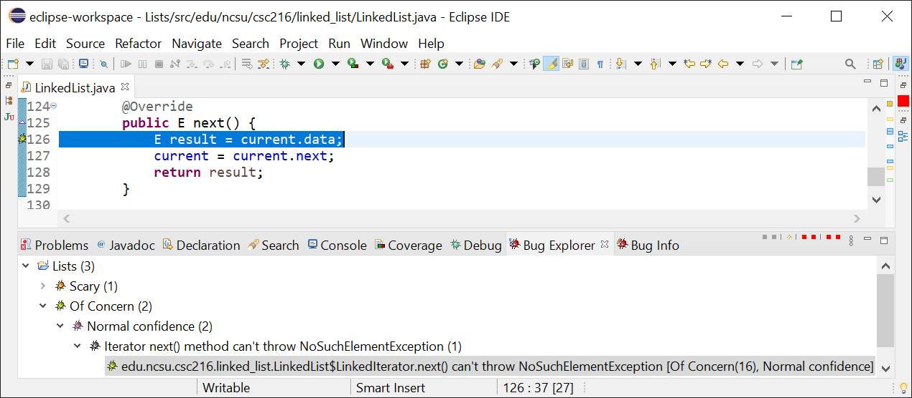

# Exercise 19.02

Given the following information from the FindBugs notification answer the following questions about this client code:

> _If you are not able to see questions below [click here](https://docs.google.com/forms/d/e/1FAIpQLSfuHQAw17ha66TNy_ufCXf2jZF_LnNU2z5WZJ0j4Ea0n4Sj1g/viewform?formkey=dDdwaDBrMllQZWdWMy11bXZpNzdGNEE6MQ#gid=0) to open the form in a new tab._

<iframe src="https://docs.google.com/forms/d/e/1FAIpQLSfuHQAw17ha66TNy_ufCXf2jZF_LnNU2z5WZJ0j4Ea0n4Sj1g/viewform?embedded=true" height="3963" frameborder="0" marginheight="0" marginwidth="0" style="width: 100%;">Loading…</iframe>
